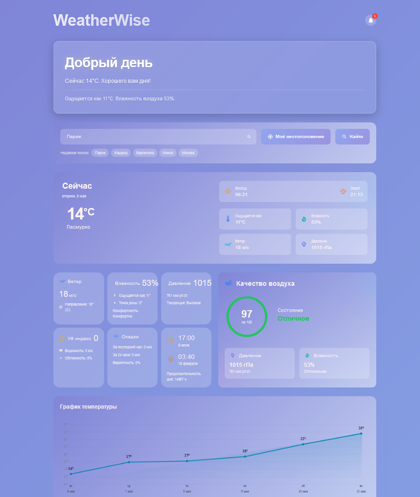

# 🌦 WeatherWise

[](https://reactjs.org/)
[](https://opensource.org/licenses/MIT)

Современное веб-приложение для просмотра погоды с красивым интерфейсом и удобным функционалом.



## ✨ Особенности

- 🎯 Точный прогноз погоды в реальном времени
- 🌍 Поиск погоды в любой точке мира
- 📱 Адаптивный дизайн для всех устройств
- 🎨 Современный и минималистичный интерфейс
- 📊 Детальная информация о погодных условиях
- 🌡️ Почасовой и недельный прогноз

## 🚀 Технологии

- React.js
- Tailwind CSS
- OpenWeather API

## 📦 Установка

1. Клонируйте репозиторий:
```bash
git clone https://github.com/your-username/weather-wise.git
cd weather-wise
```

2. Установите зависимости:
```bash
npm install
# или
yarn install
```

3. Запустите проект:
```bash
npm run dev
# или
yarn dev
```

Откройте [http://localhost:3000](http://localhost:3000) в вашем браузере.

## 🛠️ Структура проекта

```
weather-wise/
├── src/               # Next.js app директория
│   ├── components/    # React компоненты
│   ├── styles/        # Глобальные стили
├── configs/           # Конфигурационнные файлы
├── public/            # Статические файлы
└── package.json       # Зависимости и скрипты
```

## 🤝 Вклад в проект

Мы приветствуем ваш вклад в развитие проекта! Пожалуйста, ознакомьтесь с нашим руководством по внесению изменений.

1. Форкните репозиторий
2. Создайте ветку для ваших изменений
3. Внесите изменения
4. Создайте Pull Request

## 📝 Лицензия

Этот проект распространяется под лицензией MIT. Подробности в файле [LICENSE](LICENSE).

## 📞 Поддержка

Если у вас возникли вопросы или проблемы:
- Напишите в Telegram: @MrMeowMurk
- mrMeowMurk - [@mrMeowMurk](https://github.com/mrMeowMurk)


<div align="center">
Сделано с ❤️ MeowMurk
</div>
